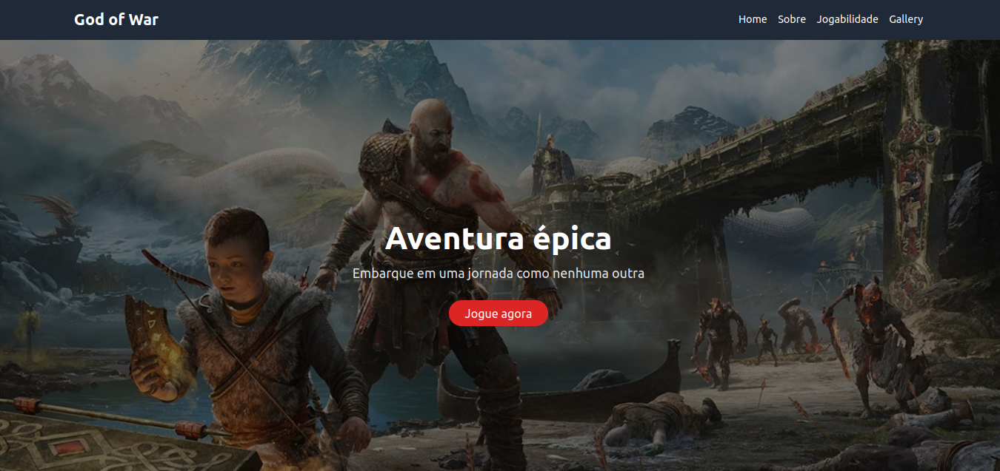
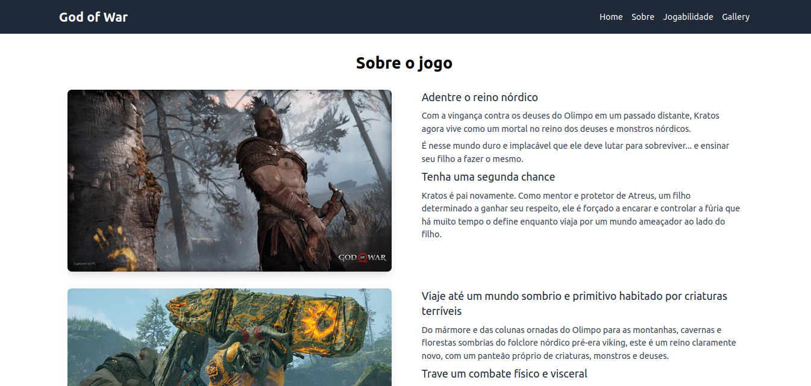
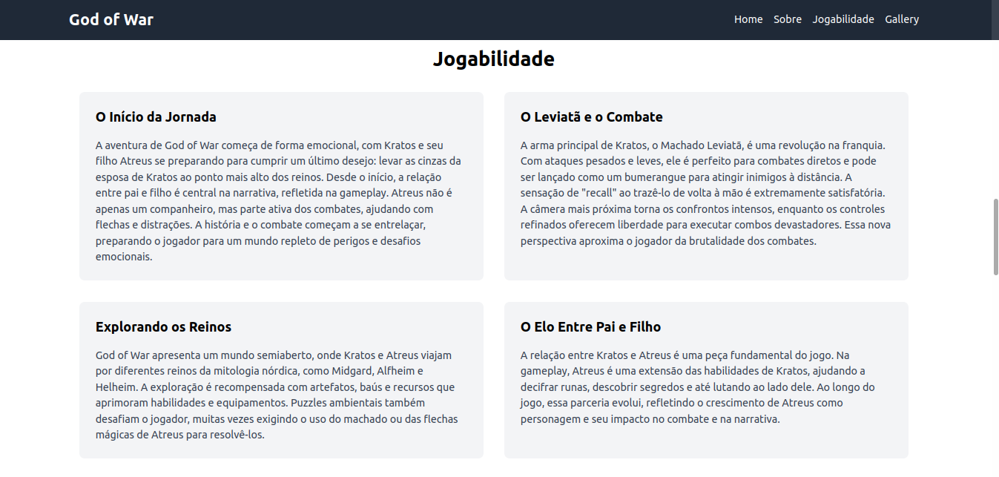

## God Of War - landing page

[](https://developer.mozilla.org/pt-BR/docs/Web/HTML)
[](https://tailwindcss.com/)

### Resumo

- [Sobre](#sobre-o-projeto)
- [Executar o projeto](#executar-o-projeto)

---

### Sobre o projeto:
Projeto da disciplina de Programação Web, desenvolvido no segundo período de **Ciência da Computação - Estácio CEUT (2018)**. Este é uma reconstrução do projeto original.

### Executar o projeto:

#### Clonar o repositório:
```sh
git clone git@github.com:maycon8609/godofwar.git
```

#### Abra o arquivo index.html em um navegador web.

---





---
